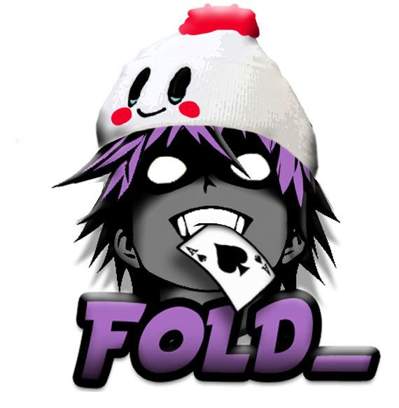

<style>
    h1 {
        display: flex;
        justify-content: center;
        text-transform: uppercase;
    }
    a {
        text-transform: capitalize;
    }
</style>


<header style="display: flex; align-items: center; flex-direction: column">


# <h1>Free Puntos Bot</h1>

<div>
<a href="https://github.com/Glassait/freePuntosBot/issues">Report bug</a> · <a href="https://github.com/Glassait/freePuntosBot/issues">Request feature</a>
</div>
</header>

<br><br>

<details>
  <summary>Table of Contents</summary>
  <ol>
    <li>
      <a href="#🛠️-languages-and-tools-🛠️">Languages and Tools</a>
    </li>
    <li>
        <a href="#getting-started">Getting Started</a>
        <ul>
            <li>
                <a href="#prerequisites">Prerequisites</a>
            </li>
            <li>
                <a href="#installation">Installation</a>
            </li>
        </ul>
    </li>
    <li>
        <a href="#contributing">Contributing</a>    
    </li>
    <li>
        <a href="#roadmap">Roadmap</a>    
    </li>
    <li>
        <a href="#contributing">Contributing</a>    
    </li>
    <li>
        <a href="#acknowledgments">Acknowledgments</a>    
    </li>
  </ol>
</details>

------

## 🛠️ Languages and Tools 🛠️

<div style="display: flex; gap: 1rem;; align-items: center">
    
    
</div>
<br>

------

## Getting Started

You will find below all the informations for the installation of the project in local.

### Prerequisites

This project need node v18.16.0 or higher

1. If you use Node Version Manager
    ```sh
    nvm install 18.16.0
    ```
2. Else download and install it from [nodejs.org](https://nodejs.org/dist/v18.16.0/)

### Installation

1. Clone the repo
   ```sh
   git clone https://github.com/Glassait/freePuntosBot
   ```
2. Install NPM packages
   ```sh
   npm install
   ```
3. Contact me on discord to get the token for the bot
4. If you want to test the bot, contact me for shutting down the prod bot and run :
    ```sh
    npm run start:mock
    ```
<br>

------

## Roadmap

- [ ] Update Architecture
- [ ] Add more readme
- [ ] Create Sequence diagram and wiki on github
- [ ] Translation for Wot express
- [ ] Upgrade autoReply
- [ ] ROULETTE
- [ ] REPLAY ANALYSE
- [ ] MINI JEU TRIVIA

See the [open issues](https://github.com/Glassait/freePuntosBot/issues?q=is%3Aopen+is%3Aissue+label%3Aenhancement) for a full list of proposed features (and known issues).
<br>

------

## Contributing

Before creating an issue, please ensure that it hasn't already been reported/suggested, and double-check the documentation.
See the contribution guide if you'd like to submit a PR.
<br>

------

## Acknowledgments

Use this space to list resources you find helpful and would like to give credit to. I've included a few of my favorites to kick things off!

* [Badge Shields](https://shields.io)
* [Readme template](https://github.com/othneildrew/Best-README-Template/blob/master/README.md?plain=1)
